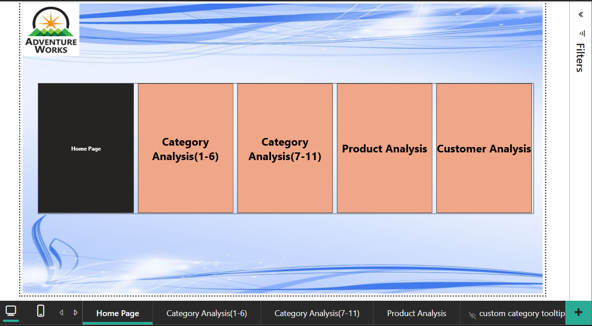
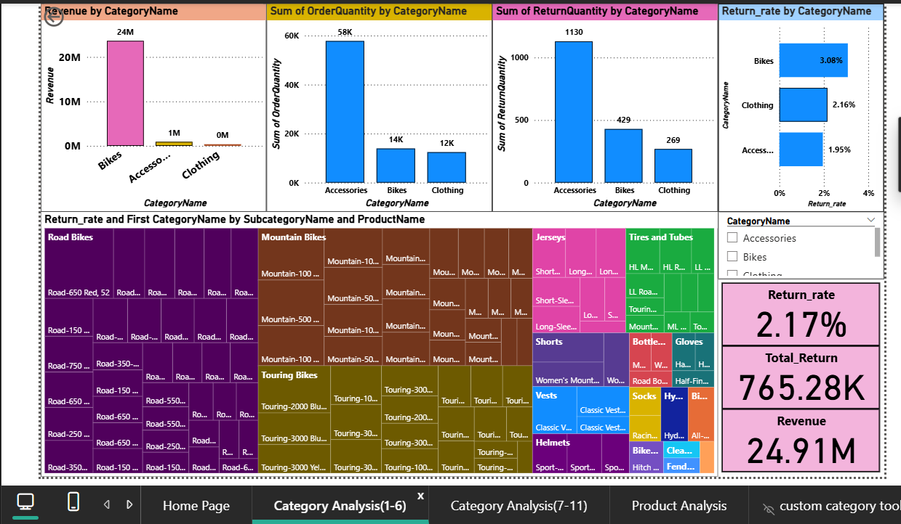
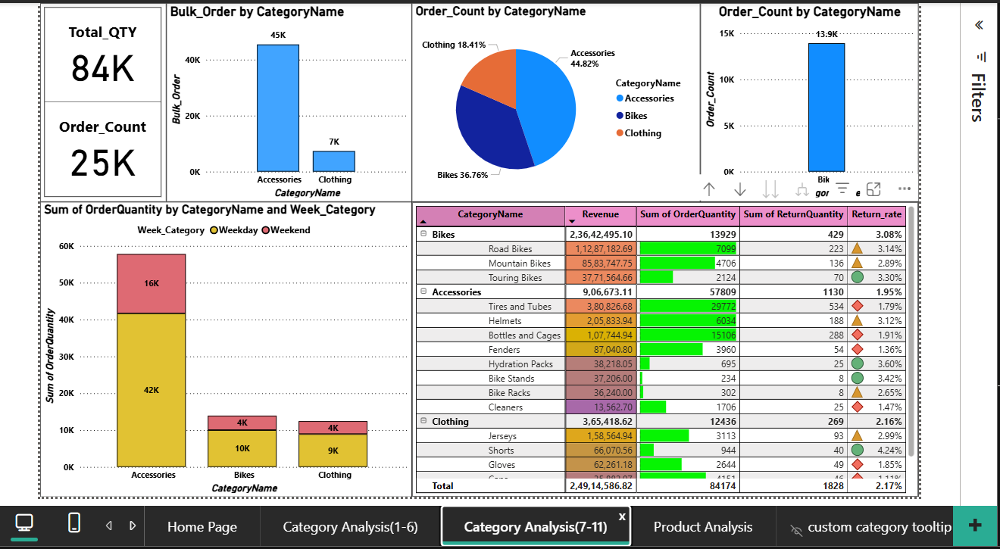
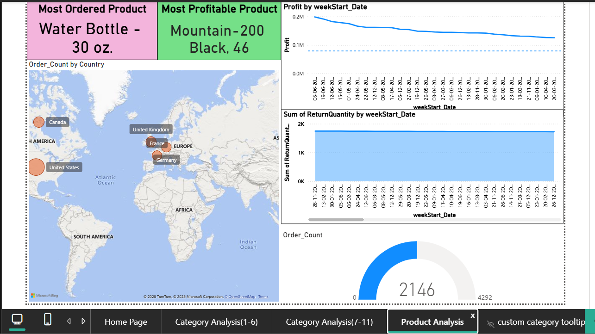
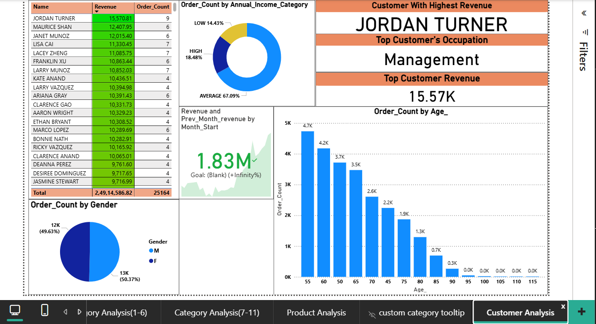

# 📈 Power BI Dashboard – Adventure Works Sales Analysis

## 📝 Overview

This Power BI project explores sales, returns, and customer data for the Adventure Works company. The dashboard delivers insights into multi-year sales trends, regional and category performance, customer segmentation, and return analysis.

The goal is to transform raw data into a comprehensive and interactive dashboard that supports data-driven decisions for business stakeholders.

---

## 📂 Project Structure
```
Power BI- Adventure Works Project/
│
├── 📊 Advanture project solution.pbix # Main Power BI dashboard file
│
├── 📁 Data Files/
│ ├── Calendar.csv
│ ├── Customers.csv
│ ├── Products.csv
│ ├── Product_Categories.csv
│ ├── Product_Subcategories.csv
│ ├── Returns.csv
│ ├── Sales_2015.csv
│ ├── Sales_2016.csv
│ ├── Sales_2017.csv
│ └── Territories.csv
│
├── 🖼️ Assets/
│ ├── AdventureWorks_Logo.png
│ └── AdventureWorksLogo.jpg
├── outputs/
│   └── plots

```
## 🖼️ Dashboard Preview











---

## 📊 Dashboard Features

- **Sales Performance** by Year, Region, and Category
- **Returns Analysis** by Product and Geography
- **Customer Demographics** and Sales Behavior
- **Interactive Filters** for Year, Product Type, and Geography
- Clean design with branding using AdventureWorks logo

---

## 💡 Key Business Questions Answered

- How have sales grown over the years across different regions?
- What are the top-performing products and categories?
- Where are returns most frequent, and what is their trend?
- Which customer segments drive the most revenue?

---

## 🛠️ Tools Used

- Power BI Desktop
- DAX for calculated measures and KPIs
- CSV files as data source

---

## 🚀 How to Use

1. Download and open `Advanture project solution.pbix` in Power BI Desktop.
2. Review and interact with the dashboard using slicers and filters.
3. Modify the data model or visuals as per your requirements.

---

## 📌 Author

**Abhishek Bhardwaj**  
[LinkedIn](https://www.linkedin.com/in/abhishekbhardwaj28) | [GitHub](https://github.com/abhishek-9617)
